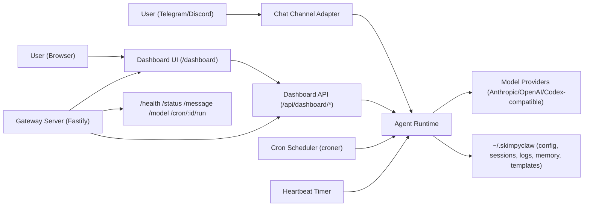
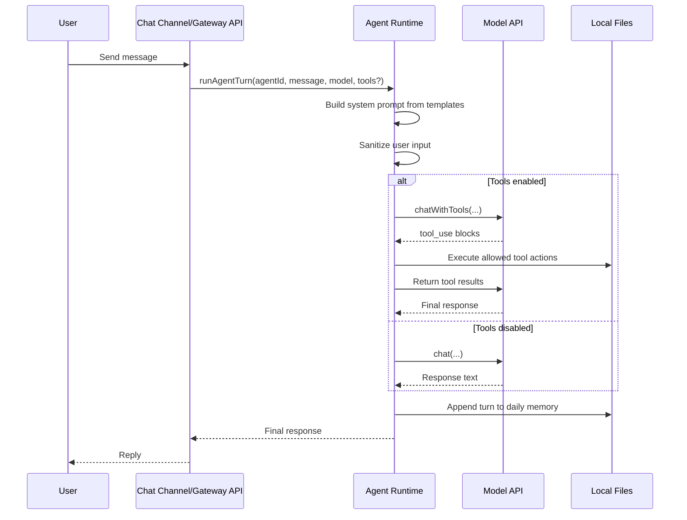
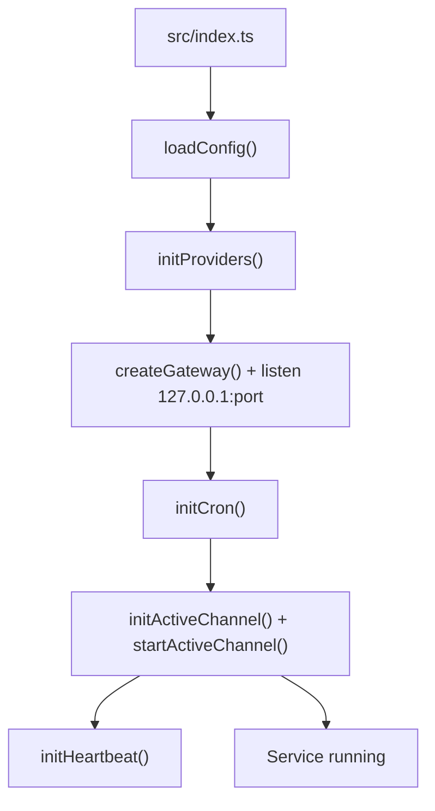

# SkimpyClaw 👙🦞

SkimpyClaw is a tiny, cheeky, mini-"me" inspired by OpenClaw.
Think: pocket-sized brain, lobster attitude, zero chill for boring workflows.

Lightweight personal AI assistant with:
- Telegram or Discord chat interface (single active channel)
- Local HTTP gateway + web dashboard
- Scheduled cron routines
- Periodic heartbeat checks
- Optional tool-enabled agent execution (read/write/list/bash within allowed paths)
- Background subagents (coding, research, general) with dedicated identities
- Conversation history controls (`/new`, `/compact`)

## Assistant personality (SOUL)

SkimpyClaw’s default behavior (from `templates/SOUL.md`) is:
- Direct, resourceful, and proactive
- Playful and a little sassy (without being rude or dismissive)
- Not sycophantic; keeps responses concise and useful
- Works within your existing tools/workflows
- Keeps private things private and asks before external messaging

Default proactive themes include morning check-ins, stale PR nudges, meeting prep prompts, and habit reminders.

## Architecture

### Component view



### Runtime flow (message handling)



### Startup and background services



## Tech stack

- TypeScript (ESM)
- Fastify (HTTP server + dashboard routes)
- grammy (Telegram bot)
- discord.js (Discord bot)
- Croner (scheduling)
- Anthropic SDK + OpenAI SDK (model providers)
- Vitest (tests)

## Repository layout

```text
src/
  index.ts        # app entrypoint
  setup.ts        # interactive first-time setup wizard
  gateway.ts      # Fastify server + top-level routes
  api.ts          # dashboard API routes
  dashboard.ts    # dashboard frontend HTML
  agent.ts        # prompt assembly, model calls, tool loop, memory writes
  subagent.ts     # background task dispatch with typed presets + auto-setup
  tools.ts        # Read/Write/Glob/Bash tool implementations
  channels.ts     # active channel selection + proactive routing
  telegram.ts     # Telegram commands and message handling
  discord.ts      # Discord commands and message handling
  cron.ts         # job scheduling + execution + cron logging
  heartbeat.ts    # periodic health/attention checks
  security.ts     # allowlist, sanitization, rate limit, secret redaction
  config.ts       # config load/save + path helpers
  types.ts        # shared type definitions
templates/        # default template markdown files copied during setup
dist/             # compiled output
```

## Prerequisites

- Node.js 20+
- pnpm
- Telegram bot token (from @BotFather) and/or Discord bot token
- Anthropic API key (or compatible auth token config)

## Quick start

1. Install dependencies:

```bash
pnpm install
```

2. Run onboarding:

```bash
pnpm run cli -- onboard
```

This creates and populates:
- `~/.skimpyclaw/config.json`
- `~/.skimpyclaw/.env`
- `~/.skimpyclaw/agents/main/*.md` (from `templates/`)

3. Start locally:

```bash
pnpm run dev
```

4. Verify health:

```bash
curl http://127.0.0.1:18790/health
```

5. Open dashboard:

- `http://127.0.0.1:18790/dashboard`
- Use dashboard bearer token shown in startup logs (also stored in config)

## NPM scripts

- `pnpm run start` - run once
- `pnpm run dev` - run with watch mode
- `pnpm run setup` - interactive setup (legacy)
- `pnpm run onboard` - interactive onboarding via CLI
- `pnpm run cli -- <command>` - run CLI commands
- `pnpm run build` - compile TypeScript to `dist/`
- `pnpm run typecheck` - type-check only
- `pnpm run test` - run Vitest

## CLI

After build, the package exposes a `skimpyclaw` binary. During development:

```bash
pnpm run cli -- help
```

Common commands:

- `skimpyclaw onboard` - run onboarding wizard
- `skimpyclaw start` - start in foreground
- `skimpyclaw status` - show service + gateway status
- `skimpyclaw logs --file stdout --lines 200 --follow` - tail logs
- `skimpyclaw config get gateway.port`
- `skimpyclaw config set gateway.port 18790`
- `skimpyclaw model smart`
- `skimpyclaw send "plan my day"`
- `skimpyclaw cron list`
- `skimpyclaw cron run morning`

## Configuration overview

Main config file: `~/.skimpyclaw/config.json`

Top-level sections:
- `gateway`: HTTP port and mode
- `agents`: default agent + agent definitions
- `models`: provider credentials + model aliases (`apiKey`, optional `authToken`, optional `baseURL`, optional `authPath`)
- `channels.active`: preferred active channel (`telegram` or `discord`)
- `channels.telegram`: token, allowlist, optional `tools`, optional `dailyNotesDir`, optional `defaultAllowedPaths`
- `channels.discord`: token, allowlist, optional `tools`, optional `defaultAllowedPaths`, optional `defaultChannelId`
- `cron.jobs`: scheduled tasks
- `heartbeat`: interval, prompt, optional `model`, optional `tools`
- `dashboard.token`: API auth token for `/api/dashboard/*`

Environment placeholders in JSON are supported:
- `${ANTHROPIC_API_KEY}`
- `${TELEGRAM_BOT_TOKEN}`
- `${DISCORD_BOT_TOKEN}`
- `${HOME}`

## Langfuse (optional)

Enable tracing by adding a `langfuse` block to your config:

```json
"langfuse": {
  "enabled": true,
  "publicKey": "${LANGFUSE_PUBLIC_KEY}",
  "secretKey": "${LANGFUSE_SECRET_KEY}",
  "baseUrl": "https://cloud.langfuse.com",
  "environment": "local",
  "release": "dev",
  "exportMode": "batched"
}
```

Traces are created per agent turn with tool calls captured as child observations when tools are used.

**Costs:** We record token usage where providers report it. Costs may be blank unless Langfuse has model pricing configured (OAuth/Codex often won’t include costs).

## Browser tool (Playwright)

Optional, disabled by default. Enable via tool config:

```json
"channels": {
  "telegram": {
    "tools": {
      "enabled": true,
      "allowedPaths": ["${HOME}/.skimpyclaw"],
      "browser": {
        "enabled": true,
        "headless": true,
        "allowFile": false,
        "slowMoMs": 50,
        "userAgent": "",
        "viewport": { "width": 1280, "height": 720 },
        "profileDir": "${HOME}/.skimpyclaw/browser-profile"
      }
    }
  }
}
```

Actions: `open(url)`, `click(selector)`, `type(selector,text)`, `waitFor(selector|text)`, `screenshot(file_path?)`, `wait(timeMs)`, `close()`.

Profile:
- Uses a persistent browser profile directory so logins/cookies are remembered between runs.
- Default: `~/.skimpyclaw/browser-profile` (set `browser.profileDir` to change).

CLI wrapper:
```bash
skimpyclaw browser open https://example.com --headful --slowmo 50
skimpyclaw browser waitFor "h1"
skimpyclaw browser screenshot
skimpyclaw browser wait --ms 30000   # manual login window
skimpyclaw browser close
```

Security notes:
- `file://` URLs are blocked unless `allowFile` is true **and** the path is inside `allowedPaths`.
- Screenshots must be saved under `allowedPaths`.

## HTTP endpoints

Gateway routes:
- `GET /health`
- `GET /status`
- `POST /message` (`{ message, model? }`)
- `POST /model` (`{ model }`)
- `POST /cron/:id/run`
- `POST /reload` (currently returns restart-required note)
- `GET /dashboard`

Dashboard API routes (Bearer token protected when configured):
- `GET /api/dashboard/status`
- `GET /api/dashboard/sessions`
- `GET /api/dashboard/sessions/:id`
- `GET /api/dashboard/memory/:agentId`
- `GET /api/dashboard/memory/:agentId/:filename`
- `GET /api/dashboard/cron`
- `POST /api/dashboard/cron/:id/run`
- `GET /api/dashboard/model`
- `POST /api/dashboard/model`
- `GET /api/dashboard/templates/:agentId`
- `GET /api/dashboard/templates/:agentId/:name`
- `PUT /api/dashboard/templates/:agentId/:name`
- `GET /api/dashboard/logs`
- `GET /api/dashboard/logs/:filename`
- `GET /api/dashboard/config`
- `PUT /api/dashboard/config`

## Chat commands

- `/start`
- `/model <alias-or-model>`
- `/status`
- `/cron list`
- `/cron run <job-id>`
- `/heartbeat`
- `/silence <minutes>`
- `/morning`
- `/eod`
- `/focus`
- `/agent <type> [model:<alias>] <prompt>` (dispatch a background subagent)
- `/tasks` (list recent subagent tasks)
- `/cancel <id>` (cancel a running subagent task)
- `/new` (clear conversation history)
- `/compact` (summarize + compress conversation history)

Telegram-only:
- `/morning`
- `/memory`
- `/memory <filename>`

Any non-command text message is treated as a chat prompt to the agent and uses recent in-memory conversation context.

## Subagents

Background agents dispatched via `/agent` for async tasks. Each type has its own identity, tool config, and auto-generated templates under `~/.skimpyclaw/agents/<type>/`.

| Type | Emoji | Default Model | Allowed Paths | Description |
|------|-------|---------------|---------------|-------------|
| `coding` | 🔧 | claude-think | ~/.skimpyclaw, ~/Sites | Code tasks with broad file + bash access |
| `research` | 🔍 | claude-think | ~/.skimpyclaw, Obsidian vault | Research with vault access for notes |
| `general` | 🦞 | current model | ~/.skimpyclaw | General tasks with config access |

On first dispatch, the agent directory is auto-created with starter IDENTITY.md and TOOLS.md templates. The agent is registered in-memory (no config file write). You can customize templates by editing the files in `~/.skimpyclaw/agents/<type>/`.

Max 3 concurrent subagents. Results are delivered back to the Telegram chat on completion.

## Data and logs

Under `~/.skimpyclaw`:
- `config.json` - runtime configuration
- `.env` - local secrets
- `agents/main/` - main agent templates and memory
- `agents/coding/` - coding subagent templates (auto-created)
- `agents/research/` - research subagent templates (auto-created)
- `agents/general/` - general subagent templates (auto-created)
- `agents/<id>/memory/YYYY-MM-DD.md` - daily conversation memory
- `sessions/*.json` - session records (dashboard-readable)
- `logs/` - app logs
- `logs/cron/<job>-YYYY-MM-DD.log` - cron execution logs

## Security notes

- Channel access is allowlist-based (`allowFrom` IDs/usernames)
- Basic per-user message rate limiting is enabled
- User input is sanitized for common prompt-injection markers
- Dashboard config responses redact key/token-like fields
- Tool execution is constrained by `allowedPaths` and bash safety patterns

## Testing

Run:

```bash
pnpm run lint
pnpm run typecheck
pnpm run test
```

Or run the full local CI gate:

```bash
pnpm run ci
```

GitHub Actions runs the same `pnpm run ci` checks on every push and pull request.

Current tests cover:
- Dashboard API behavior and auth
- Tool name mapping and tool safety/path constraints
- Subagent dispatch, cancellation, and agent setup

## Known implementation caveats

- Telegram daily notes path and default tool paths are configurable in `channels.telegram`.
- Discord default proactive target is configurable with `channels.discord.defaultChannelId`.
- Runtime uses one active channel at a time (`channels.active`, or first enabled if unset).
- Heartbeat tool paths are configurable in `heartbeat.tools`.
- Gateway binds to `127.0.0.1` by default.
- Config reload endpoint currently indicates restart is required.
