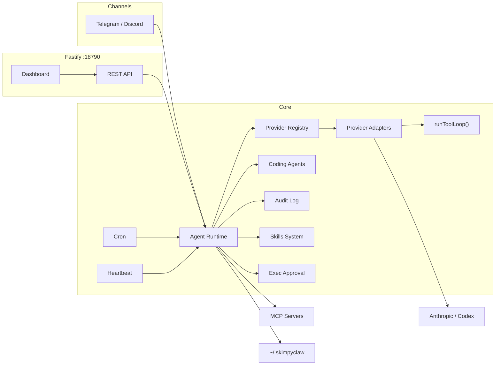

# SkimpyClaw 👙🦞

Lightweight personal AI assistant (~21k LOC). Runs locally. Telegram/Discord chat, scheduled routines, a web dashboard, and a tool-enabled agent — all in one tiny service.

## Why SkimpyClaw vs OpenClaw

Both are personal AI assistants you run yourself. The difference is scope.

|                     | SkimpyClaw (~21k LOC)                   | OpenClaw (~700k LOC)                                     |
| ------------------- | --------------------------------------- | -------------------------------------------------------- |
| **Channels**        | Telegram, Discord                       | WhatsApp, Signal, iMessage, Slack, Teams, Matrix, + more |
| **Setup**           | `skimpyclaw onboard` → done             | Daemon + wizard + per-channel pairing                    |
| **Codebase**        | Read it in an afternoon                 | Full platform with extensions, packages, native UI       |
| **Model support**   | Anthropic, Codex                        | Same + more                                              |
| **Release cadence** | Move fast, no stability guarantees      | Stable / beta / dev channels                             |

Use SkimpyClaw if you live in Telegram or Discord, want to read and own every line, and don't need 13 channels. Use OpenClaw if you need to support multiple channels like WhatsApp, Signal, iMessage, or Slack — or want a more polished, maintained platform.

## Features

- **Chat interface** — Telegram and Discord bots with persistent conversation history
- **Tool-enabled agent** — file read/write, bash, fetch, MCP tools via mcporter
- **Multi-modal support** — voice messages (STT/TTS), image analysis
- **Agents** — configure multiple local agents with their own identity, prompts, model, effort, and memory; Discord adds reusable `/agent` profiles and `@alias <message>` shortcuts
- **Coding agents** — delegate coding tasks to Claude Code or Codex with `code_with_agent`; Discord threads can also run bidirectional interactive Claude sessions that `--resume` the same process
- **Cron scheduler** — run agent prompts or shell scripts on a schedule
- **Web dashboard** — Preact/Vite SPA with status, cron, audit log, memory, templates, config editor, skills, approvals
- **Heartbeat** — periodic keep-alive with Telegram/Discord alerts
- **Skills** — domain-specific capabilities loaded from `~/.skimpyclaw/skills/`
- **Exec approval** — human-in-the-loop approval for sensitive bash commands (tier 2-3 risks)
- **Voice** — optional TTS/STT support (ElevenLabs, OpenAI, macOS `say`, local Whisper)
- **Observability** — optional Langfuse tracing per agent turn
- **Audit logging** — JSONL-based audit traces for all agent interactions
- **Model providers** — Anthropic and Codex (ChatGPT backend)

## Architecture

SkimpyClaw routes all model calls through a provider adapter registry in `src/providers/index.ts`.

- `chat()` and `chatWithTools()` both resolve provider/model and dispatch to a `ProviderAdapter`.
- Adapters implement `isAvailable()`, `chat()`, and `chatWithTools()` behavior via a shared interface.
- Tool-enabled turns use one common execution path: `runToolLoop()` in `src/providers/tool-loop.ts`.
- Context compaction is unified through shared context-management utilities used by all adapters.



See [docs/guide/architecture.md](docs/guide/architecture.md) for runtime flow and startup sequence diagrams.

## Quick Start

```bash
pnpm add -g skimpyclaw
skimpyclaw onboard
skimpyclaw start --daemon
```

Onboarding validates your Telegram token, provider auth, and creates:

- `~/.skimpyclaw/config.json`
- `~/.skimpyclaw/agents/main/*.md` (from templates)

**Stop/Restart daemon (macOS):**

```bash
skimpyclaw stop
skimpyclaw restart
```

**Uninstall helper:**

```bash
skimpyclaw uninstall          # removes launch agent, keeps ~/.skimpyclaw
skimpyclaw uninstall --purge  # removes launch agent and ~/.skimpyclaw
pnpm remove -g skimpyclaw     # removes global package
```

**Verify:**

```bash
curl http://127.0.0.1:18790/health
```

**Open dashboard:**

```
http://127.0.0.1:18790/dashboard
```

Bearer token is shown in startup logs.

## Security

SkimpyClaw uses defense-in-depth for local execution: strict config/secrets handling, bearer-authenticated control endpoints, constrained tool paths, SSRF protections, and safer command execution defaults.

For the full security model and controls, see [docs/guide/security.md](docs/guide/security.md).

## Tech Stack

- **Backend:** TypeScript (ESM), Fastify, Vitest
- **Frontend:** Preact, Vite, TypeScript
- **Chat:** grammy (Telegram), discord.js (Discord)
- **Scheduling:** Croner
- **AI SDKs:** Anthropic SDK, OpenAI SDK
- **Observability:** Langfuse (optional)

## Project Structure

```
src/
  index.ts              # App entrypoint with logging setup
  gateway.ts            # Fastify server + top-level routes
  agent.ts              # Prompt assembly, runAgentTurn orchestration, memory writes
  tools.ts              # Tool registry + dispatch
  tools/                # Tool executors (bash, fetch, file tools, path utils, execute context)
  providers/            # Provider registry, adapters, unified tool loop, provider implementations
  code-agents/          # Background coding-agent runtime (executor/parser/registry + interactive sessions)
  channels/             # Channel adapters/utilities (telegram/discord, Discord agent profile routing)
  file-lock.ts          # In-memory file lock for concurrent writes
  audit.ts              # Append-only audit log (trace/event model, JSONL storage)
  cron.ts               # Job scheduling + execution + cron logging
  heartbeat.ts          # Periodic health/attention checks
  channels.ts           # Active channel selection + proactive routing
  telegram.ts           # Telegram bot commands and message handling
  discord.ts            # Discord bot commands and message handling
  voice.ts              # Voice input/output (TTS/STT via providers)
  digests.ts            # Daily digest generation for cron job outputs
  skills.ts             # Skill loading, eligibility checks, and prompt injection
  skills-types.ts       # TypeScript types for skills system
  exec-approval.ts      # Human-in-the-loop exec approval flow with risk tiers
  api.ts                # Dashboard REST API under /api/dashboard/*
  dashboard-frontend.ts # Dashboard static asset serving
  security.ts           # Auth, path validation, bash command blocklist, rate limiting
  config.ts             # Config loading and validation
  types.ts              # All TypeScript interfaces and types
  setup.ts              # Interactive setup wizard
  langfuse.ts           # Observability integration with cost tracking
  usage.ts              # Token usage tracking and aggregation
  service.ts            # Runtime service management
  cli.ts                # CLI command definitions
  cache.ts              # TTL cache utility
  sessions.ts           # Session persistence for chat history
  doctor/               # Health check system
    index.ts
    checks.ts
    formatters.ts
    runner.ts
    types.ts

web/dashboard/          # Preact/Vite dashboard frontend
  src/
    App.tsx
    api/client.ts
    components/
    pages/              # Overview, Cron, Audit, Memory, Config, Skills, etc.

templates/              # Default template markdown files
  SOUL.md
  IDENTITY.md
  USER.md
  TOOLS.md
  BOOT.md
  HEARTBEAT.md
  MEMORY.md
  AGENTS.md
  BOOTSTRAP.md

dist/                   # Compiled output + built dashboard assets
```

## Documentation

| Doc                                            | Contents                                                         |
| ---------------------------------------------- | ---------------------------------------------------------------- |
| [docs/guide/architecture.md](docs/guide/architecture.md)   | Component diagram, runtime flow, startup sequence, source layout |
| [docs/guide/configuration.md](docs/guide/configuration.md) | Full config reference, all sections with examples                |
| [docs/guide/security.md](docs/guide/security.md)           | Security model and runtime safeguards                             |
| [docs/guide/tools.md](docs/guide/tools.md)                 | Built-in tools, fetch, MCP integration, code agents             |
| [docs/guide/dashboard.md](docs/guide/dashboard.md)         | Web dashboard, all HTTP endpoints + API routes                   |
| [docs/guide/agents.md](docs/guide/agents.md)               | Core agents, prompt directories, Discord profile aliases         |
| [docs/guide/coding-agents.md](docs/guide/coding-agents.md) | Coding-agent execution model and CLI backends                    |
| [docs/guide/cli.md](docs/guide/cli.md)                     | CLI commands, service management                                 |
| [docs/guide/chat-commands.md](docs/guide/chat-commands.md) | Telegram/Discord bot commands                                    |
| [docs/guide/discord-updates.md](docs/guide/discord-updates.md) | Discord workflow documentation maintenance process            |
| [docs/guide/changelog.md](docs/guide/changelog.md)         | Documentation and behavior changelog                              |
| [docs/guide/skills.md](docs/guide/skills.md)               | Skills system, built-in skills, creating custom skills           |
| [docs/guide/data-storage.md](docs/guide/data-storage.md)   | File layout, audit log format, security notes                    |
| [Setup Guide](https://docs.skimpyclaw.xyz/guide/setup-guide.html) | Step-by-step installation and setup guide                        |
| [docs/guide/troubleshooting.md](docs/guide/troubleshooting.md) | Common issues and solutions                                  |

## Development

Requires Node.js 22.20 or newer (Node 22 or 24 LTS) and pnpm 10.29.3.

```bash
# Install dependencies
pnpm install

# Run in development mode (hot reload)
pnpm dev

# Build TypeScript and dashboard
pnpm build

# Run tests
pnpm test

# Run full CI gate
pnpm ci

# Run doctor checks
pnpm run doctor
```

## License

MIT
