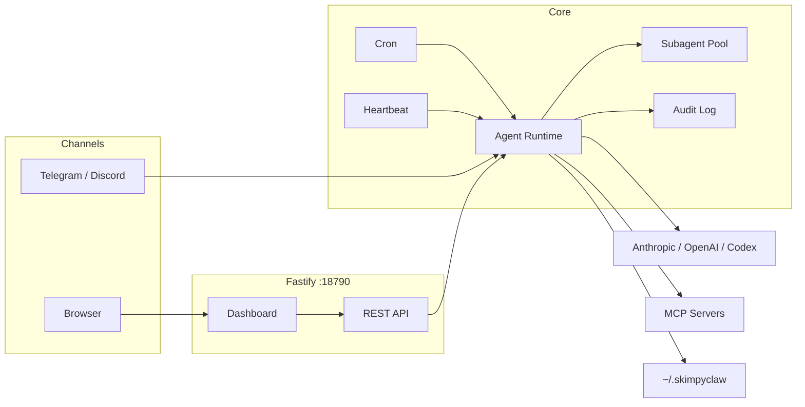

# SkimpyClaw 👙🦞

Lightweight personal AI assistant (~17k LOC). Runs locally. Telegram/Discord chat, scheduled routines, a web dashboard, and a tool-enabled agent — all in one tiny service.

## Why SkimpyClaw vs OpenClaw

Both are personal AI assistants you run yourself. The difference is scope.

|                     | SkimpyClaw (~17k LOC)                   | OpenClaw (~700k LOC)                                     |
| ------------------- | --------------------------------------- | -------------------------------------------------------- |
| **Channels**        | Telegram, Discord                       | WhatsApp, Signal, iMessage, Slack, Teams, Matrix, + more |
| **Setup**           | `skimpyclaw onboard` → done             | Daemon + wizard + per-channel pairing                    |
| **Codebase**        | Read it in an afternoon                 | Full platform with extensions, packages, native UI       |
| **Model support**   | Anthropic, OpenAI, Kimi, MiniMax, Codex | Same + more                                              |
| **Release cadence** | Move fast, no stability guarantees      | Stable / beta / dev channels                             |

Use SkimpyClaw if you live in Telegram or Discord, want to read and own every line, and don't need 13 channels. Use OpenClaw if you need to support multiple channels like WhatsApp, Signal, iMessage, or Slack — or want a more polished, maintained platform.

## Features

- **Chat interface** — Telegram and Discord, SINGLE active channel at a time
- **Tool-enabled agent** — file read/write, bash, browser (Playwright), MCP tools via mcporter
- **Subagents** — model autonomously spawns coding/research/general subagents with retry + concurrency control
- **Cron scheduler** — run agent prompts or shell scripts on a schedule
- **Web dashboard** — status, cron, audit log, memory, templates, config editor
- **Heartbeat** — periodic keep-alive with Telegram alerts
- **Skills** — domain-specific capabilities loaded from `~/.skimpyclaw/skills/`
- **Exec approval** — human-in-the-loop approval for sensitive tool calls
- **Voice** — optional TTS/STT support (ElevenLabs and others), voice/audio message transcription (Telegram + Discord); Discord voice messages and audio file attachments (ogg, mp3, wav, m4a, webm, flac, aac, opus) are auto-transcribed using the same Whisper-based pipeline as Telegram
- **Observability** — optional Langfuse tracing per agent turn
- **Multiple model providers** — Anthropic, OpenAI, Kimi, MiniMax, Codex (ChatGPT backend), any OpenAI-compatible API

## Architecture



See [docs/architecture.md](docs/architecture.md) for runtime flow and startup sequence diagrams.

## Quick start

**Install:**

```bash
npm install -g skimpyclaw
```

**Run onboarding:**

```bash
skimpyclaw onboard
```

Onboarding validates your Telegram token, provider auth, and creates:

- `~/.skimpyclaw/config.json`
- `~/.skimpyclaw/agents/main/*.md` (from templates)

**Start:**

```bash
skimpyclaw start
```

**Verify:**

```bash
curl http://127.0.0.1:18790/health
```

**Open dashboard:**

```
http://127.0.0.1:18790/dashboard
```

Bearer token is shown in startup logs.

## Tech stack

- TypeScript (ESM), Fastify, Vitest
- grammy (Telegram), discord.js (Discord)
- Croner (scheduling), Playwright (browser)
- Anthropic SDK, OpenAI SDK

## Docs

| Doc                                            | Contents                                                         |
| ---------------------------------------------- | ---------------------------------------------------------------- |
| [docs/architecture.md](docs/architecture.md)   | Component diagram, runtime flow, startup sequence, source layout |
| [docs/configuration.md](docs/configuration.md) | Full config reference, all sections with examples                |
| [docs/tools.md](docs/tools.md)                 | Built-in tools, browser tool, MCP integration                    |
| [docs/subagents.md](docs/subagents.md)         | Subagent types, concurrency, file locking, flow diagram          |
| [docs/dashboard.md](docs/dashboard.md)         | Web dashboard, all HTTP endpoints + API routes                   |
| [docs/cli.md](docs/cli.md)                     | CLI commands, npm scripts                                        |
| [docs/chat-commands.md](docs/chat-commands.md) | Telegram/Discord bot commands                                    |
| [docs/skills.md](docs/skills.md)               | Skills system, built-in skills, creating custom skills           |
| [docs/data-storage.md](docs/data-storage.md)   | File layout, audit log format, security notes                    |
