# SkimpyClaw Harness Architecture Analysis

Current architecture snapshot after the unified provider adapter + tool-loop migration.

---

## 1. Runtime + Request Flow (Current)

```mermaid
flowchart TD
  CLI["CLI / Service Start\ncli.ts -> service.ts"] --> RT["startRuntime(config)"]
  RT --> PInit["initProviders()\nproviders/index.ts"]
  RT --> GW["Fastify Gateway\ngateway.ts"]
  RT --> CH["Channels\ntelegram/discord"]
  RT --> CRON["cron.ts"]
  RT --> HB["heartbeat.ts"]

  GW --> RAT["runAgentTurn()\nagent.ts"]
  CH --> RAT
  CRON --> RAT
  HB --> RAT

  RAT --> PR["providers/index.ts\nchat() / chatWithTools()"]
  PR --> ROUTE["resolveProviderRoute()\n+ adapter selection"]

  ROUTE --> A1["AnthropicAdapter"]
  ROUTE --> A2["OpenAIAdapter(provider)"]
  ROUTE --> A3["CodexAdapter"]

  A1 --> LOOP["runToolLoop()\nproviders/tool-loop.ts"]
  A2 --> LOOP
  A3 --> LOOP

  LOOP --> CTX["adapter.compactMessages()\n-> context-manager.ts"]
  LOOP --> EXEC["executeTool()\ntools.ts"]
  EXEC --> BUILTIN["Read / Write / Glob / Bash / Fetch / Browser"]
  EXEC --> CODEAGENTS["code_with_agent"]
  EXEC --> MCP["MCP (Anthropic path only)"]
```

---

## 2. Provider Registry Routing (`src/providers/index.ts`)

`chat()` and `chatWithTools()` both route through the same registry:

1. Resolve model alias + provider route via `resolveProviderRoute()`.
2. Select adapter with `getAdapter(provider)`:
- `anthropic` -> `AnthropicAdapter`
- any configured Responses API provider (`codex` auth path) -> `CodexAdapter`
- otherwise -> `OpenAIAdapter(provider)`
3. `chatWithTools()` delegates to `runToolLoop()` (single shared loop).

Codex compatibility path is still handled:
- `openai/*codex*` can route to `CodexAdapter` when Codex provider is configured (`shouldUseCodexAliasProvider`).

---

## 3. Adapter Contract (`src/providers/adapter.ts`)

`ProviderAdapter` is the provider boundary. Shared loop owns orchestration; adapter owns wire format.

Core methods:
- `isAvailable()`
- `chat(...)`
- `buildMessages(...)`
- `buildToolDefs(...)`
- `call(...)` -> returns `NormalizedResponse`
- `appendAssistantResponse(...)`
- `appendToolResult(...)` / optional `appendToolResults(...)`
- `compactMessages(...)`
- `recordUsage(...)`
- optional hooks: `getToolDefinitionOptions(...)`, `onEmptyFinalResponse(...)`

This keeps loop behavior uniform while allowing provider-specific message formats.

---

## 4. Unified Tool Loop (`src/providers/tool-loop.ts`)

`runToolLoop()` is now the single execution path for Anthropic, OpenAI-compatible, and Codex providers.

Per iteration:
1. Abort check.
2. Context compaction via `adapter.compactMessages(...)`.
3. Provider call via `adapter.call(...)`.
4. Usage/cost aggregation + guard token tracking.
5. If no tool calls: finalize response (with optional adapter recovery pass).
6. If tool calls exist:
- append assistant response
- execute tool calls via `executeTool(...)`
- apply guard logic (spin/no-progress)
- append tool results back in provider-native format

Common concerns centralized here:
- iteration limits
- tool logging
- no-progress/spin guard
- audit events
- Langfuse observation lifecycle

---

## 5. Current Provider Adapters + Capabilities

| Adapter | File | Tool Loop | MCP Tools | Notable Behavior |
|---|---|---|---|---|
| Anthropic | `src/providers/adapters/anthropic-adapter.ts` | Shared `runToolLoop` | Yes | Native Claude message/tool blocks, prompt caching support, batched `tool_result` append |
| OpenAI-compatible | `src/providers/adapters/openai-adapter.ts` | Shared `runToolLoop` | No | Works across configured OpenAI-style providers; OpenAI tool-call format; strips `<think>` blocks where needed |
| Codex | `src/providers/adapters/codex-adapter.ts` | Shared `runToolLoop` | No | Responses/SSE path, guarded `function_call.arguments`, optional final text-only recovery pass when tool run ends without user-facing text |

MCP constraint (current):
- MCP tool discovery/execution is in `tools.ts`.
- `OpenAIAdapter` and `CodexAdapter` explicitly return `{ includeMcp: false }`.
- Anthropic path is the only adapter path that includes MCP tool definitions.

---

## 6. Context Compaction Path (Where Triggered)

Trigger path:
1. `runAgentTurn()` builds `toolConfig` and calls `chatWithTools(...)`.
2. `providers/index.ts` resolves adapter and calls `runToolLoop(...)`.
3. `runToolLoop()` calls `adapter.compactMessages(...)` at the start of each iteration.
4. Adapter delegates to `context-manager.ts` using provider-specific format helpers.

Compaction behavior (`src/providers/context-manager.ts`):
- Triggered when estimated context tokens exceed `maxContextTokens`.
- First attempt: LLM summary (`compactMessages` -> `llmSummarize` -> `chat(...)`).
- Fallback: mechanical truncation of tool-result-heavy head context.
- Keeps tail messages untouched (`KEEP_TAIL`) to preserve immediate continuity.
- Uses `WeakSet` marker to avoid repeated re-summarization loops on already-compacted arrays.

---

## 7. CLI/Runtime High-Level Flow

Startup (`skimpyclaw start`):
1. `cli.ts` loads config and calls `startRuntime(config)`.
2. `service.ts` initializes providers, code-agent state, sandbox probing/cleanup, gateway, cron, channels, heartbeat.

Request entry points to `runAgentTurn()`:
- Channel handlers (Telegram/Discord)
- Gateway API routes
- Cron jobs (`agentTurn` payload)
- Heartbeat checks

Within `runAgentTurn()`:
1. Build system prompt from templates + skills.
2. Sanitize input + compose message history.
3. Resolve model/provider route.
4. Build `ExecuteToolContext`.
5. Route to `chat()` or `chatWithTools()`.
6. Persist memory + trace/usage side effects.

---

## 8. Edge-Case Risks / Hardening Opportunities

- Compaction default mismatch risk: comments/docs mention different defaults in places; align and enforce one source of truth for `maxContextTokens` default.
- MCP discovery cold-start latency: first `discoverMcpTools()` can add turn latency; consider explicit warmup or async preload at startup when Anthropic tools are enabled.
- Tool result growth still drives compaction pressure: add optional per-tool output caps before history append for very noisy commands.
- Codex finalization retry is best-effort: add explicit metric/counter for empty-final-response recoveries to catch regressions early.
