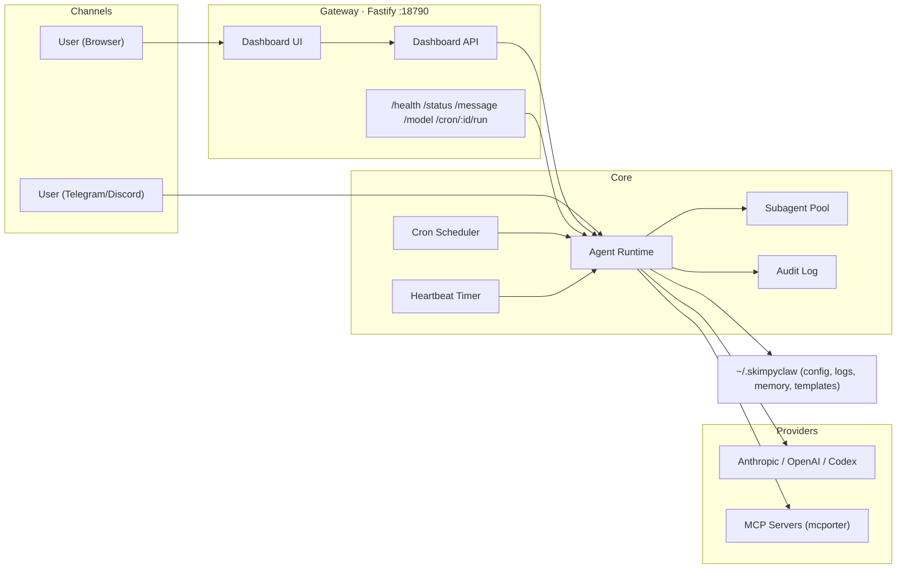
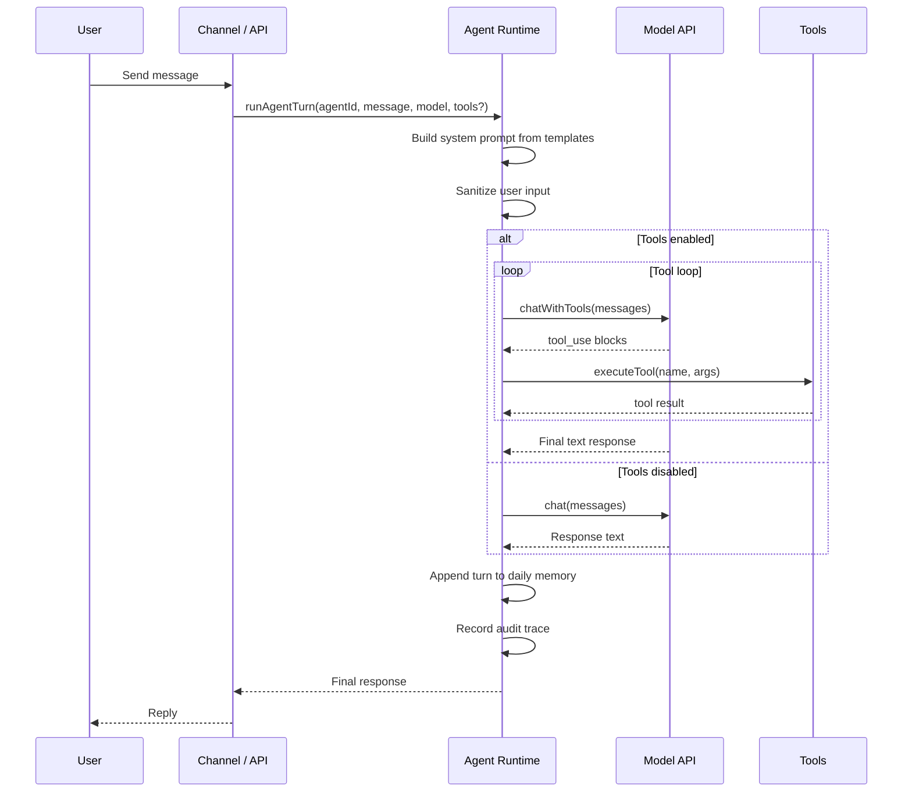
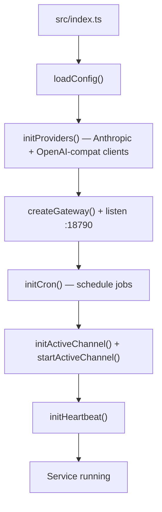

# Architecture

## Component view



## Runtime flow (message handling)



## Startup sequence



## Source layout

```text
src/
  index.ts          # App entrypoint
  gateway.ts        # Fastify server + top-level routes
  agent.ts          # Prompt assembly, model calls, tool loop, memory writes
  tools.ts          # Tool registry, MCP auto-discovery, built-in implementations
  subagent.ts       # Background task dispatch: retry, concurrency, disk registry
  file-lock.ts      # In-memory file lock for concurrent subagent writes
  audit.ts          # Append-only audit log (trace/event model, JSONL storage)
  cron.ts           # Job scheduling + execution + cron logging
  heartbeat.ts      # Periodic health/attention checks
  channels.ts       # Active channel selection + proactive routing
  telegram.ts       # Telegram commands and message handling
  discord.ts        # Discord commands and message handling
  voice.ts          # Voice input/output (TTS/STT via providers)
  digests.ts        # Daily digest generation
  skills.ts         # Skill loading and routing
  exec-approval.ts  # Human-in-the-loop exec approval flow
  api.ts            # Dashboard REST API under /api/dashboard/*
  dashboard.ts      # Dashboard frontend (inline HTML/CSS/JS)
  security.ts       # Allowlist, sanitization, rate limiting, secret redaction
  config.ts         # Config load/save + path helpers
  types.ts          # Shared TypeScript types
  setup.ts          # Interactive setup wizard
  langfuse.ts       # Observability integration
  service.ts        # Systemd service management
  cli.ts            # CLI command definitions

templates/          # Default template markdown files copied during setup
dist/               # Compiled output
```
