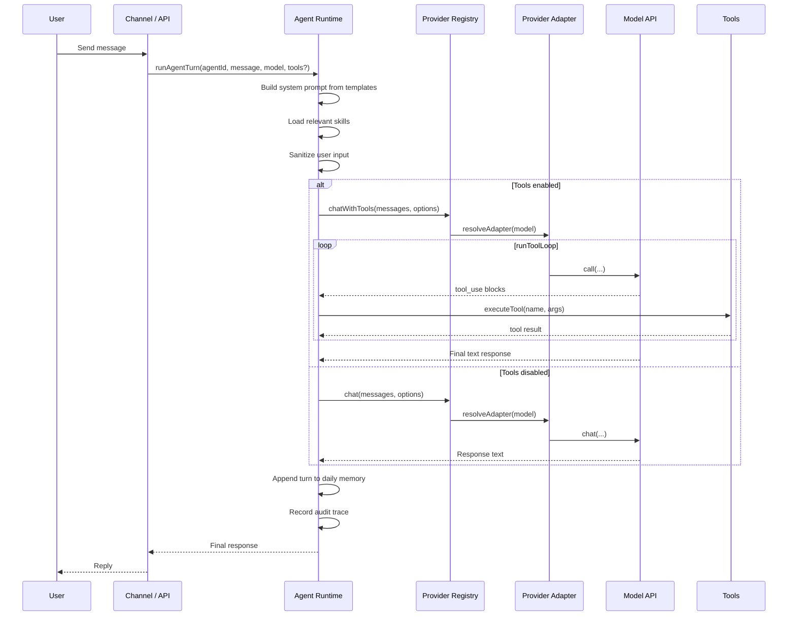
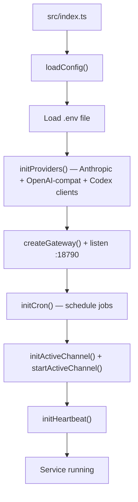
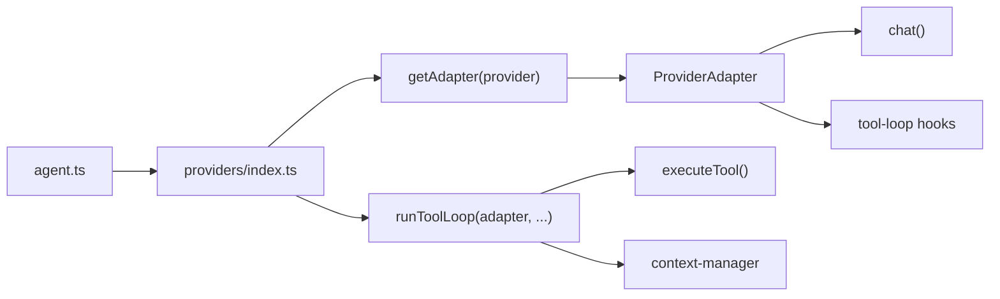
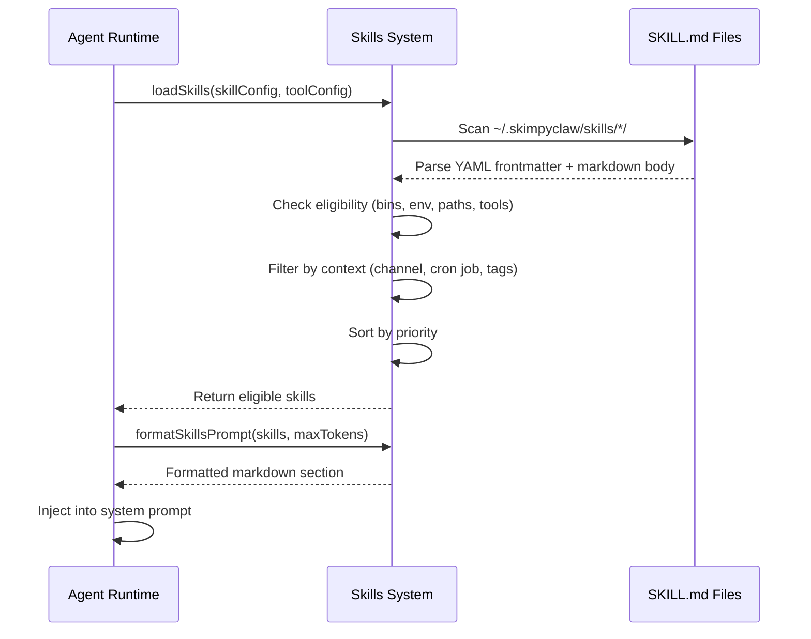
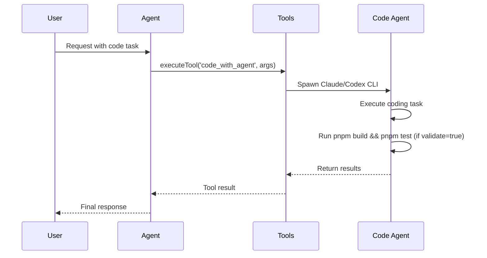
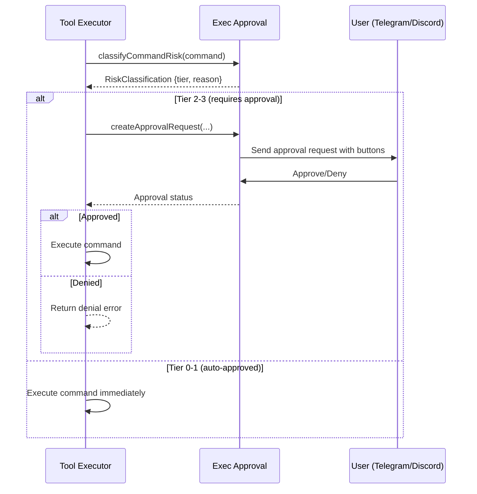

# Architecture

## Component View

<p>
  <a href="/architecture-diagram.html" target="_blank" rel="noopener">
    👙🦞 Open the full interactive diagram →
  </a>
</p>

The diagram shows the full system at a glance: input channels (Telegram, Discord, Dashboard, CLI) → Fastify gateway → core runtime (agent runner, provider router, Discord profile routing, cron, heartbeat) → tool executor → tools (built-ins, exec approval, `code_with_agent`, skills) → external providers (Anthropic, Codex, MCP) and local storage under `~/.skimpyclaw/`.

<details>
<summary>Plain-text summary</summary>

```
CHANNELS     Telegram · Discord · Web Dashboard · CLI
                                    ↓
GATEWAY      Fastify :18790  (bearer auth, dashboard + agent routes)
                                    ↓
CORE         Agent Runner · Provider Router · Discord Profile Routing · Cron · Heartbeat
                                    ↓
TOOLS        Read · Write · Glob · Bash · Fetch
                Exec Approval (risk tiers 0–3)
                code_with_agent → Claude / Codex CLIs
                Skills (trigger-loaded prompt snippets)
                                    ↓
PROVIDERS    Anthropic · Codex · MCP (mcporter)
                                    ↓
STORAGE      ~/.skimpyclaw/  (config · logs · agents · skills)
```
</details>

## Runtime Flow (Message Handling)



<details>
<summary>📄 Text version</summary>

```
User   Channel/API   Agent Runtime   Provider Registry   Adapter   Model API   Tools
 │          │              │                 │              │          │         │
 │──message───────────────►│                 │              │          │         │
 │          │──runAgentTurn(agent,msg)──────►│              │          │         │
 │          │              │──build prompt                  │          │         │
 │          │              │──load skills                   │          │         │
 │          │              │──sanitize                      │          │         │
 │          │              │                 │              │          │         │
 │          │   [Tools enabled]             │              │          │         │
 │          │              │──chatWithTools─►│              │          │         │
 │          │              │                 │──resolve────►│          │         │
 │          │              │                 │              ╔══════════╧══════╗  │
 │          │              │                 │              ║   runToolLoop    ║  │
 │          │              │                 │              ║ ──call──────────►│  │
 │          │              │                 │              ║ ◄─tool calls─────│  │
 │          │              │──executeTool──────────────────────────────────────►│
 │          │              │◄────────────────────────────────────tool result────│
 │          │              │                 │              ╚═══════════════════╝
 │          │              │◄────────────────final response──────│          │     │
 │          │              │                 │              │          │         │
 │          │   [Tools disabled]            │              │          │         │
 │          │              │──chat──────────►│              │          │         │
 │          │              │                 │──resolve────►│          │         │
 │          │              │                 │              │──chat───►│         │
 │          │              │                 │              │◄─response│         │
 │          │              │──append to memory                                │
 │          │              │──record audit                                    │
 │          │◄─────────────│                 │              │          │         │
 │◄─reply──────────────────│                 │              │          │         │
```
</details>

## Startup Sequence



<details>
<summary>📄 Text version</summary>

```
src/index.ts
     │
     ▼
┌─────────────────────────┐
│     loadConfig()        │
└─────────────────────────┘
     │
     ▼
┌─────────────────────────┐
│    Load .env file       │
└─────────────────────────┘
     │
     ▼
┌─────────────────────────┐
│  initProviders()        │
│  Anthropic + OpenAI     │
│  + Codex clients        │
└─────────────────────────┘
     │
     ▼
┌─────────────────────────┐
│  createGateway()        │
│  + listen :18790        │
└─────────────────────────┘
     │
     ▼
┌─────────────────────────┐
│    initCron()           │
│    schedule jobs        │
└─────────────────────────┘
     │
     ▼
┌─────────────────────────┐
│  initActiveChannel()    │
│  + startActiveChannel() │
└─────────────────────────┘
     │
     ▼
┌─────────────────────────┐
│    initHeartbeat()      │
└─────────────────────────┘
     │
     ▼
┌─────────────────────────┐
│    Service running      │
└─────────────────────────┘
```
</details>

## Source Layout

```text
src/
  index.ts              # App entrypoint with file logging setup
  gateway.ts            # Fastify server + top-level routes
  agent.ts              # Prompt assembly, model calls, tool loop, memory writes, Langfuse tracing
  tools.ts              # Tool registry, MCP auto-discovery, code agents (code_with_agent)
  model-selection.ts    # Shared model-selection contract (alias/provider-model/bare-id resolution)
  file-lock.ts          # In-memory file lock for concurrent writes
  audit.ts              # Append-only audit log (trace/event model, JSONL storage)
  cron.ts               # Job scheduling + execution + cron logging
  heartbeat.ts          # Periodic health/attention checks
  channels.ts           # Active channel selection + proactive routing
  channels/
    telegram/           # Telegram bot commands and message handling (Grammy)
    discord/            # Discord bot commands, profile aliases, and message handling (discord.js)
  voice.ts              # Voice input/output (TTS/STT via multiple providers)
  digests.ts            # Daily digest generation for cron job article outputs
  skills.ts             # Skill loading, eligibility checks, and prompt injection
  skills-types.ts       # TypeScript types for skills system
  exec-approval.ts      # Human-in-the-loop exec approval flow with risk tiers
  api.ts                # Dashboard REST API under /api/dashboard/*
  dashboard-frontend.ts # Dashboard static asset serving (Preact/Vite build)
  security.ts           # Auth, path validation, bash command blocklist, rate limiting
  config.ts             # Config loading with env var expansion
  types.ts              # All TypeScript interfaces and types
  setup.ts              # Interactive setup wizard
  langfuse.ts           # Observability integration with cost tracking
  usage.ts              # Token usage tracking and aggregation
  service.ts            # Runtime service management
  cli.ts                # CLI command definitions
  cache.ts              # TTL cache utility
  sessions.ts           # Session persistence for chat history
  doctor/               # Health check system
    index.ts            # Doctor entry point
    checks.ts           # Individual health checks
    formatters.ts       # Output formatting (text/JSON)
    runner.ts           # Check orchestration
    types.ts            # Doctor type definitions

templates/              # Bundled agent template markdown files
                        # Only SOUL, IDENTITY, USER, HEARTBEAT are copied by default
                        # during `skimpyclaw onboard` (REQUIRED_TEMPLATE_DEFAULTS).
                        # The rest are available to copy into ~/.skimpyclaw/agents/main/ manually.
  SOUL.md               # Core agent personality and principles  [copied by default]
  IDENTITY.md           # Agent name, emoji, persona             [copied by default]
  USER.md               # User context and preferences           [copied by default]
  HEARTBEAT.md          # Heartbeat check instructions           [copied by default]
  TOOLS.md              # Tool usage instructions
  BOOT.md               # Startup behavior
  MEMORY.md             # Memory management guidelines
  AGENTS.md             # Multi-agent coordination (optional reference)
  BOOTSTRAP.md          # First-run bootstrap instructions (optional, loaded via hasBootstrap())

web/dashboard/          # Preact/Vite dashboard frontend
  src/
    App.tsx             # Main app component with routing
    api/client.ts       # API client for backend communication
    components/         # Shared UI components
    pages/              # Page components (Overview, Cron, Audit, Memory, Config, Skills, Digests, etc.)

dist/                   # Compiled output + built dashboard assets
```

## Model Provider Architecture

Provider routing is unified through `src/providers/index.ts`:

1. `chat()` resolves the provider/model, gets an adapter from the registry, and calls `adapter.chat(...)`.
2. `chatWithTools()` resolves the provider/model, gets an adapter, and runs `runToolLoop(adapter, ...)`.
3. `runToolLoop()` is the shared tool loop for all providers (iteration control, guards, tool execution, compaction, usage/audit hooks).



Adapter contract (`src/providers/adapter.ts`):

- `isAvailable()`
- `chat(messages, options, config)`
- provider-specific tool-loop methods used by `runToolLoop()` (`buildMessages`, `buildToolDefs`, `call`, result appending, compaction, usage recording)

Current adapters:

- `AnthropicAdapter`
- `CodexAdapter`

MCP support is adapter-scoped: Anthropic and Codex include MCP tool definitions.

## Skills System Flow



## Code Agent Flow



## Exec Approval Flow


