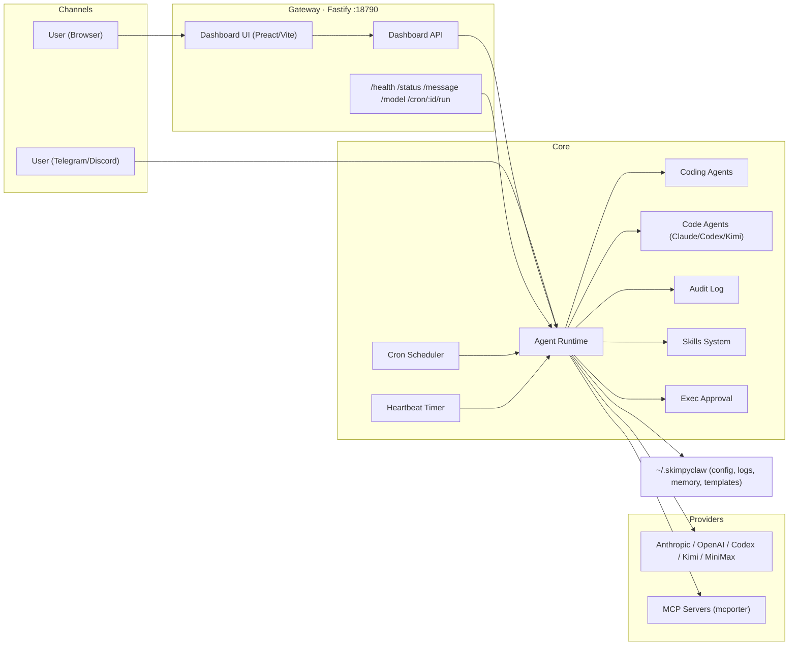
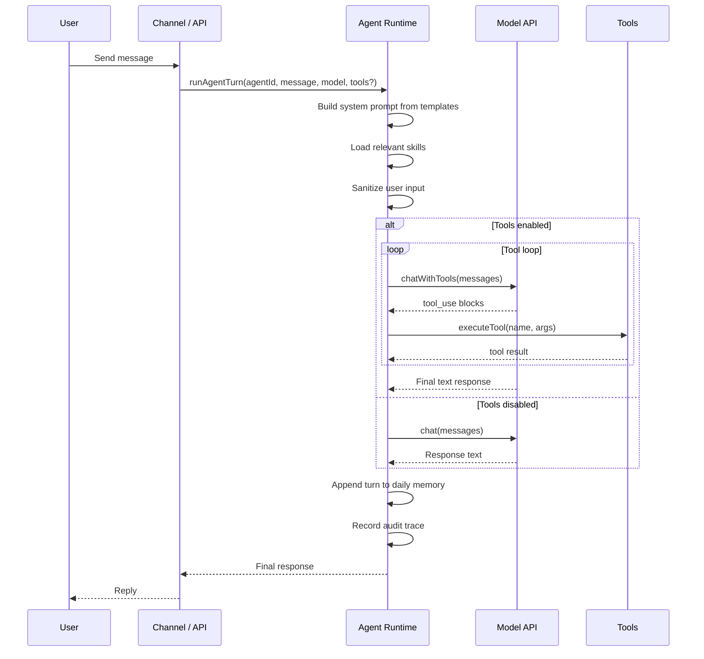
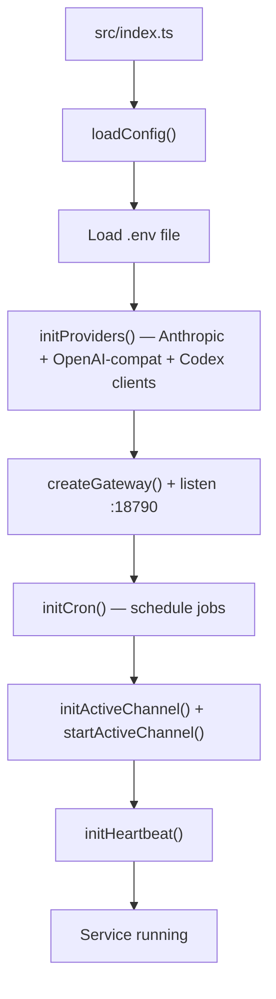
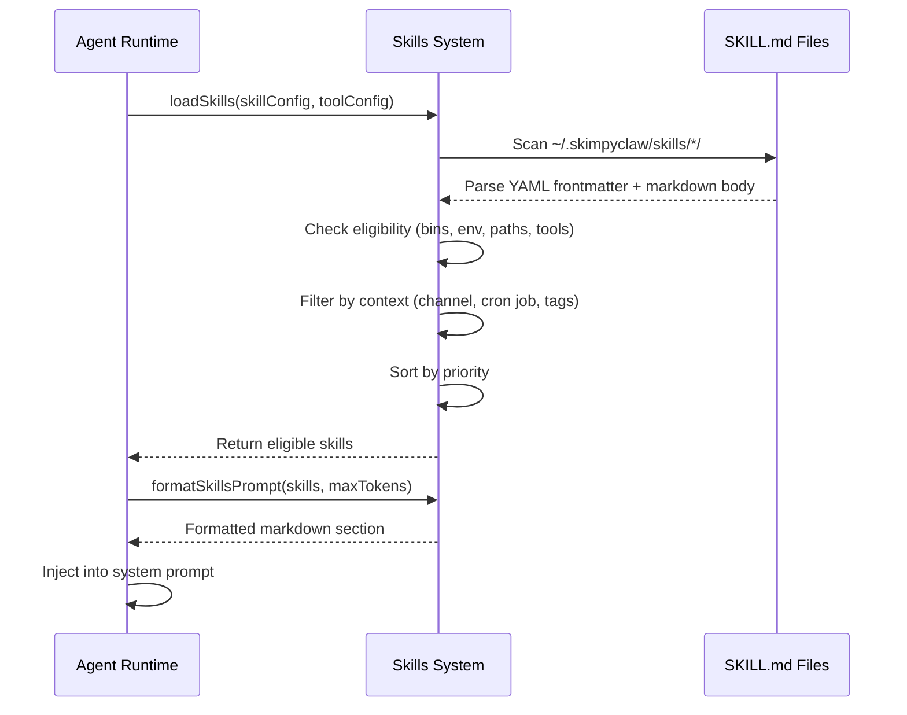
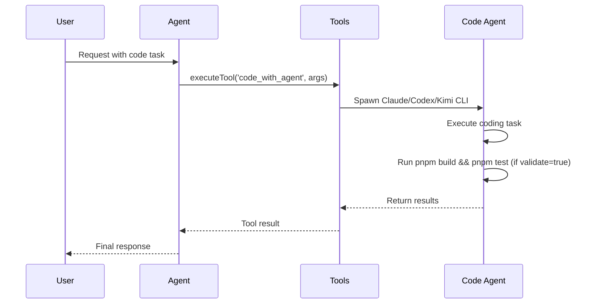
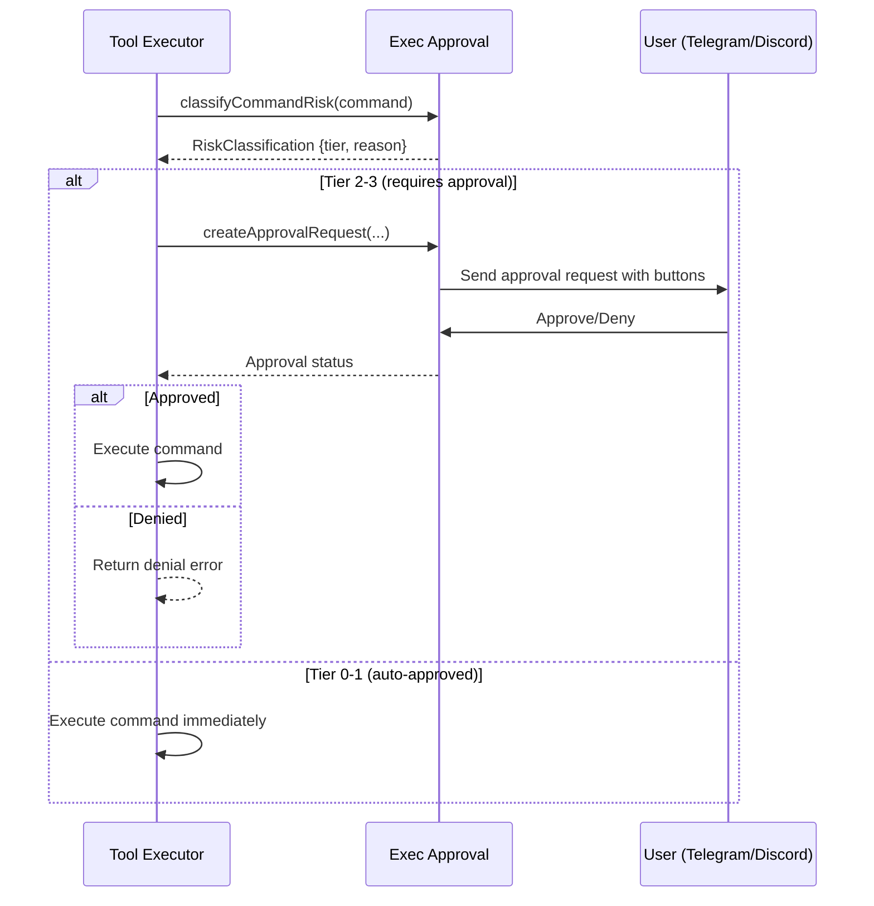

# Architecture

## Component View



<details>
<summary>📄 Text version</summary>

```
┌─────────────────────────────────────────────────────────────────────────────┐
│                              CHANNELS                                       │
│  ┌─────────────────────┐    ┌─────────────────────┐                        │
│  │ User (Telegram/     │    │ User (Browser)      │                        │
│  │      Discord)       │    │                     │                        │
│  └──────────┬──────────┘    └──────────┬──────────┘                        │
└─────────────┼──────────────────────────┼────────────────────────────────────┘
              │                          │
              ▼                          ▼
┌─────────────────────────────────────────────────────────────────────────────┐
│                         GATEWAY · Fastify :18790                           │
│  ┌─────────────────────────────────────┐   ┌─────────────────────────────┐ │
│  │ Dashboard UI (Preact/Vite) ◄────────┼───┘                             │ │
│  │                                     │      Dashboard API               │ │
│  └─────────────────────────────────────┘   └─────────────────────────────┘ │
│         │                                    │                              │
│         │    /health /status /message        │                              │
│         │    /model /cron/:id/run            │                              │
│         └────────────────────────────────────┘                              │
└─────────────────────────────────────────────────────────────────────────────┘
                                       │
                                       ▼
┌─────────────────────────────────────────────────────────────────────────────┐
│                                 CORE                                        │
│  ┌──────────────┐  ┌──────────────┐  ┌──────────────┐  ┌──────────────┐    │
│  │ Agent        │──│ Code Agents  │──│ Cron         │                    │
│  │ Runtime      │  │ (Claude/     │  │ Scheduler    │                    │
│  └──────┬───────┘  │  Codex/Kimi) │  └──────────────┘                    │
│         │                             └──────────────┘         │            │
│         │                                                      │            │
│         │    ┌──────────────┐  ┌──────────────┐  ┌──────────────┐          │
│         ├───►│ Audit Log    │  │ Skills       │  │ Heartbeat    │          │
│         │    └──────────────┘  │ System       │  │ Timer        │          │
│         │                      └──────────────┘  └──────────────┘          │
│         │                                                                   │
│         │    ┌──────────────┐                                              │
│         └───►│ Exec         │                                              │
│              │ Approval     │                                              │
│              └──────────────┘                                              │
└─────────────────────────────────────────────────────────────────────────────┘
                                       │
                                       ▼
┌─────────────────────────────────────────────────────────────────────────────┐
│                               PROVIDERS                                     │
│  ┌──────────────────────────────────────┐  ┌─────────────────────────────┐  │
│  │ Anthropic / OpenAI / Codex / Kimi    │  │ MCP Servers (mcporter)      │  │
│  │ / MiniMax                            │  │                             │  │
│  └──────────────────────────────────────┘  └─────────────────────────────┘  │
└─────────────────────────────────────────────────────────────────────────────┘
                                       │
                                       ▼
┌─────────────────────────────────────────────────────────────────────────────┐
│  ~/.skimpyclaw/ (config, logs, memory, templates)                          │
└─────────────────────────────────────────────────────────────────────────────┘
```
</details>

## Runtime Flow (Message Handling)



<details>
<summary>📄 Text version</summary>

```
User    Channel/API    Agent Runtime    Model API    Tools
 │           │               │              │          │
 │──message────────────────►│              │          │
 │           │──runAgentTurn(agent, msg)──►│          │
 │           │               │──build prompt          │
 │           │               │──load skills           │
 │           │               │──sanitize              │
 │           │               │              │          │
 │           │    [Tools enabled]                      │
 │           │               │              │          │
 │           │               ╔══════════════╧══════════╗
 │           │               ║       TOOL LOOP         ║
 │           │               ║  ──chatWithTools───────►│
 │           │               ║  ◄──tool_use blocks─────│
 │           │               ║  ──executeTool──────────┼──►
 │           │               ║  ◄──tool result─────────┼──│
 │           │               ╚═════════════════════════╝
 │           │               │              │          │
 │           │               │◄─final response          │
 │           │               │                         │
 │           │    [Tools disabled]                     │
 │           │               │              │          │
 │           │               │──chat───────►│          │
 │           │               │◄─response────│          │
 │           │               │              │          │
 │           │               │──append to memory       │
 │           │               │──record audit           │
 │           │◄──────────────│              │          │
 │◄─reply────────────────────│              │          │
 │           │               │              │          │
```
</details>

## Startup Sequence



<details>
<summary>📄 Text version</summary>

```
src/index.ts
     │
     ▼
┌─────────────────────────┐
│     loadConfig()        │
└─────────────────────────┘
     │
     ▼
┌─────────────────────────┐
│    Load .env file       │
└─────────────────────────┘
     │
     ▼
┌─────────────────────────┐
│  initProviders()        │
│  Anthropic + OpenAI     │
│  + Codex clients        │
└─────────────────────────┘
     │
     ▼
┌─────────────────────────┐
│  createGateway()        │
│  + listen :18790        │
└─────────────────────────┘
     │
     ▼
┌─────────────────────────┐
│    initCron()           │
│    schedule jobs        │
└─────────────────────────┘
     │
     ▼
┌─────────────────────────┐
│  initActiveChannel()    │
│  + startActiveChannel() │
└─────────────────────────┘
     │
     ▼
┌─────────────────────────┐
│    initHeartbeat()      │
└─────────────────────────┘
     │
     ▼
┌─────────────────────────┐
│    Service running      │
└─────────────────────────┘
```
</details>

## Source Layout

```text
src/
  index.ts              # App entrypoint with file logging setup
  gateway.ts            # Fastify server + top-level routes
  agent.ts              # Prompt assembly, model calls, tool loop, memory writes, Langfuse tracing
  tools.ts              # Tool registry, MCP auto-discovery, code agents (code_with_agent, code_with_team)
  model-selection.ts    # Shared model-selection contract (alias/provider-model/bare-id resolution)
  file-lock.ts          # In-memory file lock for concurrent writes
  audit.ts              # Append-only audit log (trace/event model, JSONL storage)
  cron.ts               # Job scheduling + execution + cron logging
  heartbeat.ts          # Periodic health/attention checks
  channels.ts           # Active channel selection + proactive routing
  channels/
    telegram/           # Telegram bot commands and message handling (Grammy)
  discord.ts            # Discord bot commands and message handling (discord.js)
  voice.ts              # Voice input/output (TTS/STT via multiple providers)
  digests.ts            # Daily digest generation for cron job article outputs
  skills.ts             # Skill loading, eligibility checks, and prompt injection
  skills-types.ts       # TypeScript types for skills system
  exec-approval.ts      # Human-in-the-loop exec approval flow with risk tiers
  api.ts                # Dashboard REST API under /api/dashboard/*
  dashboard-frontend.ts # Dashboard static asset serving (Preact/Vite build)
  security.ts           # Auth, path validation, bash command blocklist, rate limiting
  config.ts             # Config loading with env var expansion
  types.ts              # All TypeScript interfaces and types
  setup.ts              # Interactive setup wizard
  langfuse.ts           # Observability integration with cost tracking
  usage.ts              # Token usage tracking and aggregation
  service.ts            # Runtime service management
  cli.ts                # CLI command definitions
  cache.ts              # TTL cache utility
  sessions.ts           # Session persistence for chat history
  doctor/               # Health check system
    index.ts            # Doctor entry point
    checks.ts           # Individual health checks
    formatters.ts       # Output formatting (text/JSON)
    runner.ts           # Check orchestration
    types.ts            # Doctor type definitions

templates/              # Default template markdown files copied during setup
  SOUL.md               # Core agent personality and principles
  IDENTITY.md           # Agent name, emoji, persona
  USER.md               # User context and preferences
  TOOLS.md              # Tool usage instructions
  BOOT.md               # Startup behavior
  HEARTBEAT.md          # Heartbeat check instructions
  MEMORY.md             # Memory management guidelines
  AGENTS.md             # Multi-agent coordination
  BOOTSTRAP.md          # Bootstrap instructions

web/dashboard/          # Preact/Vite dashboard frontend
  src/
    App.tsx             # Main app component with routing
    api/client.ts       # API client for backend communication
    components/         # Shared UI components
    pages/              # Page components (Overview, Cron, Audit, Memory, Config, Skills, Digests, etc.)

dist/                   # Compiled output + built dashboard assets
```

## Model Provider Architecture

Three provider paths in `agent.ts`:

1. **Anthropic** — `chatWithTools()` — standard Anthropic SDK with tool_use
2. **Codex** — `codexChat()` — raw fetch to `chatgpt.com/backend-api/codex/responses` (ChatGPT backend)
3. **OpenAI-compatible** — `chat()` via OpenAI SDK — includes OpenAI, Kimi, MiniMax, openrouter, groq, etc.

Both Anthropic and Codex share `ExecuteToolContext` for tool routing and file locking.

## Skills System Flow



## Code Agent Flow



## Exec Approval Flow


