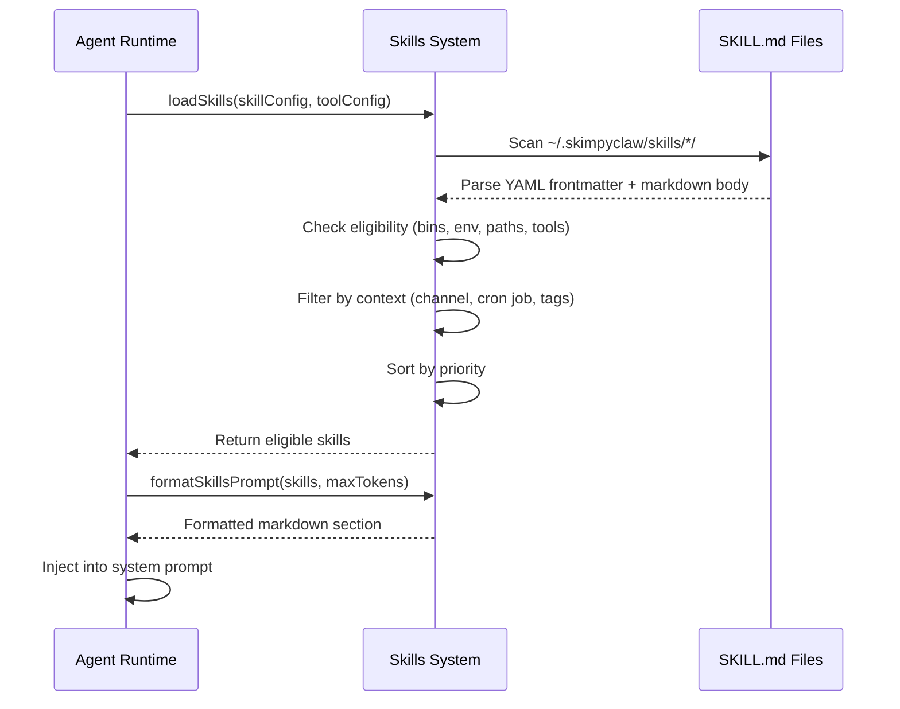

# Skills

Skills are reusable, domain-specific capabilities stored in `~/.skimpyclaw/skills/`. Each skill is a directory with a `SKILL.md` file containing instructions, examples, and workflow patterns. The agent reads relevant skill files when handling related tasks.

## How skills work

- Skills provide specialized expertise (PDF processing, calendar sync, internal search, etc.)
- The agent automatically routes to relevant skills based on task context
- Skills are modular — add or remove them without changing core code
- No rebuild needed; skill changes take effect immediately

## Creating a skill

1. Create a directory: `~/.skimpyclaw/skills/my-skill/`
2. Add `SKILL.md` with YAML frontmatter and content:

```markdown
---
name: my-skill
description: What this skill does
triggers: ['keyword1', 'keyword2']
priority: 100
emoji: 🛠️
tags: ['tag1', 'tag2']
contexts: ['telegram', 'discord', 'cron']
requires:
  bins: ['required-binary']
  env: ['REQUIRED_ENV_VAR']
  paths: ['~/required/path']
  tools: ['tool_name']
---

# My Skill

Instructions and workflow patterns here.
```

```
~/.skimpyclaw/skills/
├── my-skill/
│   └── SKILL.md          # Main instructions (required)
```

## Skill configuration

Skills can be configured in `config.json` under the `skills` section:

```json
"skills": {
  "enabled": true,
  "directory": "${HOME}/.skimpyclaw/skills",
  "entries": {
    "my-skill": true,
    "another-skill": false
  },
  "maxPromptTokens": 4000
}
```

- `enabled`: Master switch for skills system
- `directory`: Path to skills directory
- `entries`: Per-skill enable/disable overrides
- `maxPromptTokens`: Budget for injected skills content (default ~4000 chars ≈ 1000 tokens)

## Skill frontmatter fields

| Field | Type | Description |
|-------|------|-------------|
| `name` | string | Skill identifier |
| `description` | string | What the skill does |
| `triggers` | string[] | Keywords that trigger this skill |
| `priority` | number | Sort order (higher = earlier) |
| `emoji` | string | Visual identifier |
| `tags` | string[] | Categorization tags |
| `contexts` | string[] | Where skill applies (`telegram`, `discord`, `cron`) |
| `requires.bins` | string[] | Required binaries |
| `requires.env` | string[] | Required environment variables |
| `requires.paths` | string[] | Required paths |
| `requires.tools` | string[] | Required tool names |

## Skills system flow


