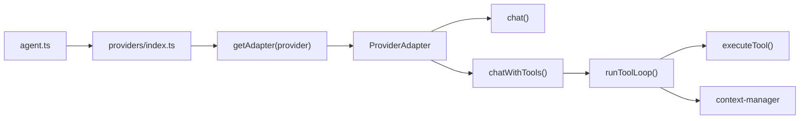

# Model Provider Architecture

Provider routing is centralized in `src/providers/index.ts` using a provider registry and adapter interface.

## Core Flow

- Both `chat()` and `chatWithTools()` calls are routed through the same adapter registry.
- Providers expose a common interface (`src/providers/adapter.ts`), including:
  - `isAvailable()`
  - `chat(messages, options, config)`
  - tool-loop adapter methods used by `runToolLoop()`
- `runToolLoop()` is the single tool execution path across Anthropic and Codex.
- Context compaction behavior is unified through shared context manager utilities used by each adapter.

## Registry + Adapters

- Registry entrypoint: `src/providers/index.ts`
- Adapter implementations:
  - `src/providers/adapters/anthropic-adapter.ts`
  - `src/providers/adapters/codex-adapter.ts`
- Provider selection is resolved from model input via `resolveProviderRoute()` and model aliases.

## MCP Support

MCP tools (via mcporter) are available on the Anthropic and Codex adapter paths. mcporter spawns MCP servers as child processes and communicates over stdio JSON-RPC. Config at `~/.mcporter/mcporter.json`.

## Model Selection Contract

`src/model-selection.ts` is the single source of truth for model input parsing:

- Accepted inputs:
  - configured alias (e.g. `codex5.6`)
  - full provider/model (e.g. `anthropic/claude-sonnet-4-6`)
  - bare model ID with `-` or `.` (e.g. `claude-sonnet-4-6`)
- Deprecated model IDs are migrated via provider utils (e.g. Claude 3.5 -> current Claude 4 aliases).
- Standardized errors:
  - unknown alias: `Unknown model alias: "<value>"`
  - malformed value: `Invalid model selection: "<value>". Use alias, provider/model, or model-id.`
- All entry points must use this contract:
  - `POST /api/dashboard/model`
  - `skimpyclaw model ...`
  - `/model` in Telegram/Discord handlers
  - Dashboard `Model` page client-side validation mirrors the same rules.

## Codex Auth

Uses `~/.codex/auth.json` with ChatGPT backend headers (`chatgpt-account-id`, `OpenAI-Beta`, `originator: codex_cli_rs`). The loader accepts the current Codex CLI shape with `tokens.account_id` and falls back to the account ID embedded in the access token.

## Codex Reasoning

Codex requests include `reasoning.summary: "auto"` and map the agent `thinking` setting to `reasoning.effort`. The direct backend accepts `low`, `medium`, `high`, and `xhigh`; user-facing `ultra` therefore maps to backend `xhigh`. Codex CLI coding-agent runs receive true `ultra`, where the CLI provides its additional orchestration behavior. Unset or `none` preserves the default `medium` effort. GPT-5.6 Sol requests use the `priority` service tier, exposed as Fast mode in Codex.
