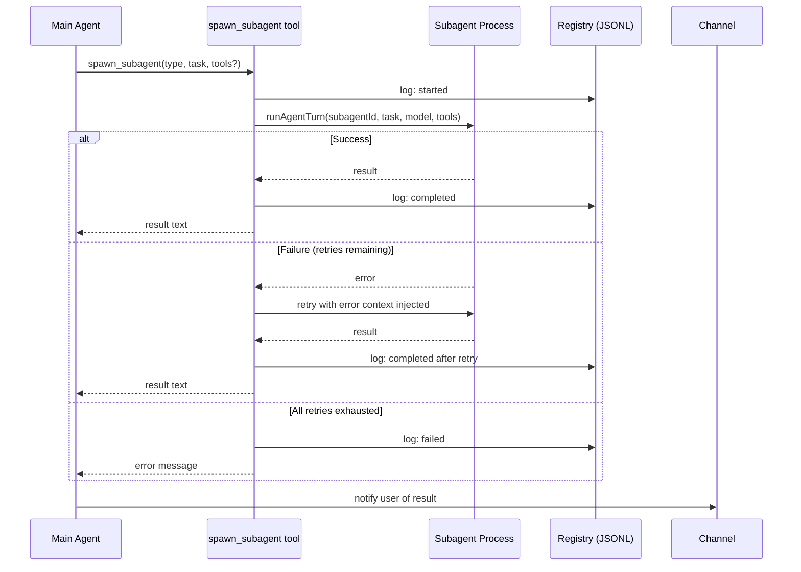

# Subagents

The model calls `spawn_subagent` autonomously when it needs to delegate work — no special commands needed.

## Subagent types

| Type | Default Model | Allowed Paths | Description |
|------|---------------|---------------|-------------|
| `coding` | claude-opus | `~/.skimpyclaw`, `~/Sites` | Code tasks with broad file + bash access |
| `research` | claude-think | `~/.skimpyclaw`, Obsidian vault | Research with vault access for notes |
| `general` | current model | `~/.skimpyclaw` | General tasks with config access |

On first dispatch, the agent directory is auto-created with starter `IDENTITY.md` and `TOOLS.md` templates at `~/.skimpyclaw/agents/<type>/`. Edit these to customize the subagent's behavior.

## Concurrency and retry

- Max concurrent subagents: 5 (configurable via `config.subagents.maxConcurrent`)
- Retry on failure: 2 retries (configurable via `config.subagents.maxRetries`)
- Error context from failed attempt is injected into retry prompt
- Disk registry at `~/.skimpyclaw/logs/subagent-runs.jsonl` (JSONL, task lifecycle events)

## File locking

When multiple subagents write files concurrently, `src/file-lock.ts` provides in-memory locks:
- 30-second acquisition timeout
- 60-second stale lock detection
- Write tool acquires lock automatically when `lockTaskId` is present in context

## Monitoring

```
/tasks          # list recent subagent tasks
/cancel <id>    # cancel a running task
/status         # shows active, running, pending counts + recent completed/failed
```

## Flow


